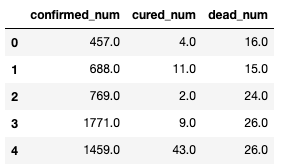
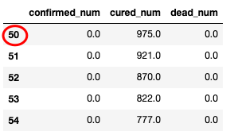
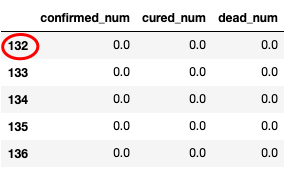

---
jupyter:
  jupytext:
    cell_metadata_filter: -all
    formats: ipynb,md
    text_representation:
      extension: .md
      format_name: markdown
      format_version: '1.3'
      jupytext_version: 1.11.2
  kernelspec:
    display_name: Python 3
    language: python
    name: python3
---

# 1-4,时间序列数据建模流程范例


2020年发生的新冠肺炎疫情灾难给各国人民的生活造成了诸多方面的影响。

有的同学是收入上的，有的同学是感情上的，有的同学是心理上的，还有的同学是体重上的。

本文基于中国2020年3月之前的疫情数据，建立时间序列RNN模型，对中国的新冠肺炎疫情结束时间进行预测。


```python
!pip install torch==1.10.0
!pip install pytorch_lightning==1.6.5 

```

```python
import torch 
import pytorch_lightning
print("torch.__version__ = ", torch.__version__)
print("pytorch_lightning.__version__ = ", pytorch_lightning.__version__) 

```

```
torch.__version__ =  1.10.0
pytorch_lightning.__version__ =  1.6.5
```


<br>

<font color="red">
 
公众号 **算法美食屋** 回复关键词：**pytorch**， 获取本项目源码和所用数据集百度云盘下载链接。
    
</font> 


```python
import os
import datetime
import torchkeras

#打印时间
def printbar():
    nowtime = datetime.datetime.now().strftime('%Y-%m-%d %H:%M:%S')
    print("\n"+"=========="*8 + "%s"%nowtime)

#mac系统上pytorch和matplotlib在jupyter中同时跑需要更改环境变量
os.environ["KMP_DUPLICATE_LIB_OK"]="TRUE" 

```

```python

```

```python
!pip install torch==1.10.0
!pip install pytorch_lightning==1.6.5 

```

```python
import torch 
import pytorch_lightning
print("torch.__version__ = ", torch.__version__)
print("pytorch_lightning.__version__ = ", pytorch_lightning.__version__) 

```

```
torch.__version__ =  1.10.0
pytorch_lightning.__version__ =  1.6.5
```

```python

```


## 一，准备数据


本文的数据集取自tushare，获取该数据集的方法参考了以下文章。

《https://zhuanlan.zhihu.com/p/109556102》


```python
import numpy as np
import pandas as pd 
import matplotlib.pyplot as plt

```

```python
%matplotlib inline
%config InlineBackend.figure_format = 'svg'

df = pd.read_csv("./eat_pytorch_datasets/covid-19.csv",sep = "\t")
df.plot(x = "date",y = ["confirmed_num","cured_num","dead_num"],figsize=(10,6))
plt.xticks(rotation=60);

```


```python
dfdata = df.set_index("date")
dfdiff = dfdata.diff(periods=1).dropna()
dfdiff = dfdiff.reset_index("date")

dfdiff.plot(x = "date",y = ["confirmed_num","cured_num","dead_num"],figsize=(10,6))
plt.xticks(rotation=60)
dfdiff = dfdiff.drop("date",axis = 1).astype("float32")

```


```python
dfdiff.head()
```




下面我们通过继承torch.utils.data.Dataset实现自定义时间序列数据集。

torch.utils.data.Dataset是一个抽象类，用户想要加载自定义的数据只需要继承这个类，并且覆写其中的两个方法即可：

* `__len__`:实现len(dataset)返回整个数据集的大小。
* `__getitem__`:用来获取一些索引的数据，使`dataset[i]`返回数据集中第i个样本。

不覆写这两个方法会直接返回错误。


```python
import torch 
from torch import nn 
from torch.utils.data import Dataset,DataLoader,TensorDataset


#用某日前8天窗口数据作为输入预测该日数据
WINDOW_SIZE = 8

class Covid19Dataset(Dataset):
        
    def __len__(self):
        return len(dfdiff) - WINDOW_SIZE
    
    def __getitem__(self,i):
        x = dfdiff.loc[i:i+WINDOW_SIZE-1,:]
        feature = torch.tensor(x.values)
        y = dfdiff.loc[i+WINDOW_SIZE,:]
        label = torch.tensor(y.values)
        return (feature,label)
    
ds_train = Covid19Dataset()

#数据较小，可以将全部训练数据放入到一个batch中，提升性能
dl_train = DataLoader(ds_train,batch_size = 38)

for features,labels in dl_train:
    break 
    
#dl_train同时作为验证集
dl_val = dl_train

```

## 二，定义模型


使用Pytorch通常有三种方式构建模型：使用nn.Sequential按层顺序构建模型，继承nn.Module基类构建自定义模型，继承nn.Module基类构建模型并辅助应用模型容器进行封装。

此处选择第二种方式构建模型。


```python
import torch
from torch import nn 
import importlib 
import torchkeras 

torch.random.seed()

class Block(nn.Module):
    def __init__(self):
        super(Block,self).__init__()
    
    def forward(self,x,x_input):
        x_out = torch.max((1+x)*x_input[:,-1,:],torch.tensor(0.0))
        return x_out
    
class Net(nn.Module):
    def __init__(self):
        super(Net, self).__init__()
        # 3层lstm
        self.lstm = nn.LSTM(input_size = 3,hidden_size = 3,num_layers = 5,batch_first = True)
        self.linear = nn.Linear(3,3)
        self.block = Block()
        
    def forward(self,x_input):
        x = self.lstm(x_input)[0][:,-1,:]
        x = self.linear(x)
        y = self.block(x,x_input)
        return y
        
net = Net()
print(net)


```

```
Net(
  (lstm): LSTM(3, 3, num_layers=5, batch_first=True)
  (linear): Linear(in_features=3, out_features=3, bias=True)
  (block): Block()
)
```

```python
from torchkeras import summary
summary(net,input_data=features);
```

```
--------------------------------------------------------------------------
Layer (type)                            Output Shape              Param #
==========================================================================
LSTM-1                                    [-1, 8, 3]                  480
Linear-2                                     [-1, 3]                   12
Block-3                                      [-1, 3]                    0
==========================================================================
Total params: 492
Trainable params: 492
Non-trainable params: 0
--------------------------------------------------------------------------
Input size (MB): 0.000069
Forward/backward pass size (MB): 0.000229
Params size (MB): 0.001877
Estimated Total Size (MB): 0.002174
--------------------------------------------------------------------------

```

```python

```

### 三，训练模型


训练Pytorch通常需要用户编写自定义训练循环，训练循环的代码风格因人而异。

有3类典型的训练循环代码风格：脚本形式训练循环，函数形式训练循环，类形式训练循环。

此处介绍一种引进pytorch_lightning库实现的类形式的训练循环。

该训练循环的代码也是torchkeras库中LightModel类的核心代码。

torchkeras详情:  https://github.com/lyhue1991/torchkeras 

注：循环神经网络调试较为困难，需要设置多个不同的学习率多次尝试，以取得较好的效果。


```python

```

```python
import torch 
from torch import nn 
import pytorch_lightning as pl
import datetime
import sys 
import numpy as np
import pandas as pd 
from copy import deepcopy

class LightModel(pl.LightningModule):
    def __init__(self,net,loss_fn,metrics_dict=None,optimizer=None,lr_scheduler=None):
        super().__init__()
        self.net = net
        self.history = {}
        
        self.train_metrics = nn.ModuleDict(metrics_dict)
        self.val_metrics = deepcopy(self.train_metrics)
        self.test_metrics = deepcopy(self.train_metrics)
        
        self.loss_fn = loss_fn
        self.optimizer = optimizer if optimizer is not None else torch.optim.Adam(self.parameters(), lr=1e-2)
        self.lr_scheduler = lr_scheduler 
        
        for p in ["net","loss_fn","metrics_dict","optimizer","lr_scheduler"]:
            self.save_hyperparameters(p)
        
    def forward(self,x):
        if self.net:
            return self.net.forward(x)
        else:
            raise NotImplementedError
            
    def shared_step(self,batch,batch_idx):
        x, y = batch
        preds = self(x)
        loss = self.loss_fn(preds,y)
        return {'loss': loss, 'preds': preds.detach(), 'y': y.detach()}
    
    def configure_optimizers(self):
        if self.lr_scheduler is None:
            return self.optimizer
        return {"optimizer":self.optimizer,"lr_scheduler":self.lr_scheduler}
    
    def training_step(self, batch, batch_idx):
        return self.shared_step(batch,batch_idx)
    
    def validation_step(self, batch, batch_idx):
        return self.shared_step(batch,batch_idx)
    
    def test_step(self, batch, batch_idx):
        return self.shared_step(batch,batch_idx)
    
    def predict_step(self, batch, batch_idx):
        if isinstance(batch,list) and len(batch)==2:
            return self(batch[0])
        else:
            return self(batch)
        
    def shared_step_end(self,outputs,stage):
        metrics = self.train_metrics if stage=="train" else (
            self.val_metrics if stage=="val" else self.test_metrics)
        for name in metrics:
            step_metric = metrics[name](outputs['preds'], outputs['y']).item()
            if stage=="train":
                self.log(name,step_metric,prog_bar=True)
        return outputs["loss"].mean()
        
    def training_step_end(self, outputs):
        return {'loss':self.shared_step_end(outputs,"train")}
            
    def validation_step_end(self, outputs):
        return {'val_loss':self.shared_step_end(outputs,"val")}
            
    def test_step_end(self, outputs):
        return {'test_loss':self.shared_step_end(outputs,"test")}
            
    def shared_epoch_end(self,outputs,stage="train"):
        metrics = self.train_metrics if stage=="train" else (
            self.val_metrics if stage=="val" else self.test_metrics)
        
        epoch = self.trainer.current_epoch
        stage_loss = torch.mean(torch.tensor([t[(stage+"_loss").replace('train_','')] for t in outputs])).item()
        dic = {"epoch":epoch,stage+"_loss":stage_loss}
        
        for name in metrics:
            epoch_metric = metrics[name].compute().item() 
            metrics[name].reset()
            dic[stage+"_"+name] = epoch_metric 
        if stage!='test':
            self.history[epoch] = dict(self.history.get(epoch,{}),**dic)    
        return dic 
    
    def training_epoch_end(self, outputs):
        dic = self.shared_epoch_end(outputs,stage="train")
        self.print(dic)
        dic.pop("epoch",None)
        self.log_dict(dic, logger=True)

    def validation_epoch_end(self, outputs):
        dic = self.shared_epoch_end(outputs,stage="val")
        self.print_bar()
        self.print(dic)
        dic.pop("epoch",None)
        self.log_dict(dic, logger=True)
        
        #log when reach best score
        ckpt_cb = self.trainer.checkpoint_callback
        monitor = ckpt_cb.monitor 
        mode = ckpt_cb.mode 
        arr_scores = self.get_history()[monitor]
        best_score_idx = np.argmax(arr_scores) if mode=="max" else np.argmin(arr_scores)
        if best_score_idx==len(arr_scores)-1:   
            self.print("<<<<<< reach best {0} : {1} >>>>>>".format(monitor,
                 arr_scores[best_score_idx]),file=sys.stderr)
            
    
    def test_epoch_end(self, outputs):
        dic = self.shared_epoch_end(outputs,stage="test")
        dic.pop("epoch",None)
        self.print(dic)
        self.log_dict(dic, logger=True)
        
    def get_history(self):
        return pd.DataFrame(self.history.values()) 
    
    def print_bar(self): 
        nowtime = datetime.datetime.now().strftime('%Y-%m-%d %H:%M:%S')
        self.print("\n"+"="*80 + "%s"%nowtime)
        
```

```python
from torchmetrics.regression import MeanAbsolutePercentageError

def mspe(y_pred,y_true):
    err_percent = (y_true - y_pred)**2/(torch.max(y_true**2,torch.tensor(1e-7)))
    return torch.mean(err_percent)


net = Net() 
loss_fn = mspe
metric_dict = {"mape":MeanAbsolutePercentageError()}

optimizer = torch.optim.Adam(net.parameters(), lr=0.03)
lr_scheduler = torch.optim.lr_scheduler.StepLR(optimizer, step_size=10, gamma=0.0001)

model = LightModel(net,
       loss_fn = loss_fn,
       metrics_dict= metric_dict,
       optimizer = optimizer,
       lr_scheduler = lr_scheduler)       

```

```python
import pytorch_lightning as pl     

#1，设置回调函数

model_ckpt = pl.callbacks.ModelCheckpoint(
    monitor='val_mape',
    save_top_k=1,
    mode='min'
)

early_stopping = pl.callbacks.EarlyStopping(monitor = 'val_mape',
                           patience=3,
                           mode = 'min'
                          )

#2，设置训练参数
# gpus=0 则使用cpu训练，gpus=1则使用1个gpu训练，gpus=2则使用2个gpu训练，gpus=-1则使用所有gpu训练，
# gpus=[0,1]则指定使用0号和1号gpu训练， gpus="0,1,2,3"则使用0,1,2,3号gpu训练
# tpus=1 则使用1个tpu训练
trainer = pl.Trainer(logger=True,
                     min_epochs=3,max_epochs=30,
                     gpus=0,
                     callbacks = [model_ckpt,early_stopping],
                     enable_progress_bar = True) 


##3，启动训练循环
trainer.fit(model,dl_train,dl_val)

```

```python
dfhistory = model.get_history() 
dfhistory 
```

```
epoch	val_loss	val_mape	train_loss	train_mape
0	0	5.974455	0.661542	6.936645	0.737031
1	1	5.086240	0.590996	5.974455	0.661542
2	2	4.237600	0.524000	5.086240	0.590996
3	3	3.408828	0.463179	4.237600	0.524000
4	4	2.614143	0.422679	3.408828	0.463179
5	5	1.896354	0.413116	2.614143	0.422679
6	6	1.304007	0.437700	1.896354	0.413116
7	7	0.866170	0.474878	1.304007	0.437700
8	8	0.585183	0.517995	0.866170	0.474878
	
```

```python

```

### 四，评估模型


评估模型一般要设置验证集或者测试集，由于此例数据较少，我们仅仅可视化损失函数在训练集上的迭代情况。

```python
%matplotlib inline
%config InlineBackend.figure_format = 'svg'

import matplotlib.pyplot as plt

def plot_metric(dfhistory, metric):
    train_metrics = dfhistory["train_"+metric]
    val_metrics = dfhistory['val_'+metric]
    epochs = range(1, len(train_metrics) + 1)
    plt.plot(epochs, train_metrics, 'bo--')
    plt.plot(epochs, val_metrics, 'ro-')
    plt.title('Training and validation '+ metric)
    plt.xlabel("Epochs")
    plt.ylabel(metric)
    plt.legend(["train_"+metric, 'val_'+metric])
    plt.show()

```

```python
#使用最佳保存点进行评估
trainer.test(ckpt_path='best', dataloaders=dl_val,verbose = False)

```

```
{'test_loss': 1.8963541984558105, 'test_mape': 0.4131162464618683}
```

```python
plot_metric(dfhistory,"loss")
```


```python
plot_metric(dfhistory,"mape")
```


```python

```

### 五，使用模型


此处我们使用模型预测疫情结束时间，即 新增确诊病例为0 的时间。

```python
#使用dfresult记录现有数据以及此后预测的疫情数据
dfresult = dfdiff[["confirmed_num","cured_num","dead_num"]].copy()
dfresult.tail()
```


```python
#预测此后1000天的新增走势,将其结果添加到dfresult中
for i in range(1000):
    arr_input = torch.unsqueeze(torch.from_numpy(dfresult.values[-38:,:]),axis=0)
    arr_predict = model.forward(arr_input)

    dfpredict = pd.DataFrame(torch.floor(arr_predict).data.numpy(),
                columns = dfresult.columns)
    dfresult = pd.concat([dfresult,dfpredict],ignore_index=True)
```

```python
dfresult.query("confirmed_num==0").head()

# 第50天开始新增确诊降为0，第45天对应3月10日，也就是5天后，即预计3月15日新增确诊降为0
# 注：该预测偏乐观
```



```python

```

```python
dfresult.query("cured_num==0").head()

# 第132天开始新增治愈降为0，第45天对应3月10日，也就是大概3个月后，即6月10日左右全部治愈。
# 注: 该预测偏悲观，并且存在问题，如果将每天新增治愈人数加起来，将超过累计确诊人数。
```



```python

```

### 六，保存模型


模型保存在了trainer.checkpoint_callback.best_model_path路径。


```python
print(trainer.checkpoint_callback.best_model_path)
print(trainer.checkpoint_callback.best_model_score)
```

```python
#pytorch_lightning不仅保留了模型参数，还保存了模型结构，可以用LightModel重新加载
model_loaded = LightModel.load_from_checkpoint(trainer.checkpoint_callback.best_model_path)
```

```python
trainer.predict(model_loaded,dataloaders=dl_val)
```

```
[tensor([[1.4974e+03, 8.5825e+01, 2.3000e+01],
         [1.8469e+03, 6.7295e+01, 4.6768e+01],
         [2.0153e+03, 1.4337e+02, 4.3701e+01],
         [2.3063e+03, 1.5312e+02, 4.9068e+01],
         [2.7721e+03, 2.5358e+02, 4.9834e+01],
         [2.6352e+03, 2.5455e+02, 5.5968e+01],
         [2.2421e+03, 3.7744e+02, 5.5968e+01],
         [2.4147e+03, 4.9740e+02, 6.5935e+01],
         [1.8918e+03, 5.8420e+02, 6.8235e+01],
         [2.1208e+03, 6.1638e+02, 7.4368e+01],
         [1.7599e+03, 6.9733e+02, 8.2802e+01],
         [1.4374e+03, 7.2561e+02, 7.4368e+01],
         [1.0808e+04, 1.1421e+03, 1.9474e+02],
         [2.8870e+03, 7.9193e+02, 9.9669e+00],
         [1.8840e+03, 1.3391e+03, 1.0964e+02],
         [1.4324e+03, 1.2903e+03, 1.0887e+02],
         [1.4610e+03, 1.3898e+03, 8.0502e+01],
         [1.3468e+03, 1.6658e+03, 7.5135e+01],
         [1.2477e+03, 1.7789e+03, 1.0427e+02],
         [2.7895e+02, 1.7353e+03, 8.7424e+01],
         [6.3425e+02, 2.0573e+03, 9.0511e+01],
         [5.8716e+02, 2.3365e+03, 8.3624e+01],
         [4.6230e+02, 2.1747e+03, 7.4431e+01],
         [1.5267e+02, 1.8011e+03, 1.1512e+02],
         [3.6241e+02, 2.5261e+03, 5.4495e+01],
         [2.8963e+02, 2.3633e+03, 3.9916e+01],
         [3.0889e+02, 2.6834e+03, 2.2262e+01],
         [2.3327e+02, 3.5342e+03, 3.3777e+01],
         [3.0461e+02, 2.8151e+03, 3.6080e+01],
         [4.0876e+02, 2.5594e+03, 2.6868e+01],
         [1.4410e+02, 2.7683e+03, 3.2242e+01],
         [8.9172e+01, 2.6756e+03, 2.3798e+01],
         [8.4892e+01, 2.5877e+03, 2.9171e+01],
         [9.9159e+01, 2.1360e+03, 2.3798e+01],
         [1.0201e+02, 1.6403e+03, 2.3030e+01],
         [7.0624e+01, 1.6373e+03, 2.1495e+01],
         [3.1389e+01, 1.6208e+03, 2.0727e+01],
         [2.8535e+01, 1.4978e+03, 1.6889e+01]])]
```


**如果本书对你有所帮助，想鼓励一下作者，记得给本项目加一颗星星star⭐️，并分享给你的朋友们喔😊!** 

如果对本书内容理解上有需要进一步和作者交流的地方，欢迎在公众号"算法美食屋"下留言。作者时间和精力有限，会酌情予以回复。

也可以在公众号后台回复关键字：**加群**，加入读者交流群和大家讨论。


