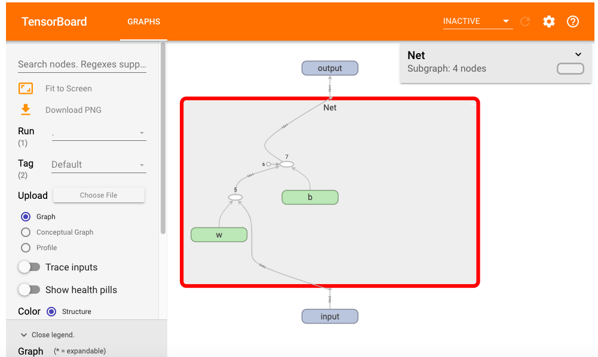

# 2-3,动态计算图


本节我们将介绍 Pytorch的动态计算图。

包括： 

* 动态计算图简介

* 计算图中的Function

* 计算图和反向传播

* 叶子节点和非叶子节点

* 计算图在TensorBoard中的可视化


### 一，动态计算图简介


Pytorch的计算图由节点和边组成，节点表示张量或者Function，边表示张量和Function之间的依赖关系。

Pytorch中的计算图是动态图。这里的动态主要有两重含义。

第一层含义是：计算图的正向传播是立即执行的。无需等待完整的计算图创建完毕，每条语句都会在计算图中动态添加节点和边，并立即执行正向传播得到计算结果。

第二层含义是：计算图在反向传播后立即销毁。下次调用需要重新构建计算图。如果在程序中使用了backward方法执行了反向传播，或者利用torch.autograd.grad方法计算了梯度，那么创建的计算图会被立即销毁，释放存储空间，下次调用需要重新创建。


**1，计算图的正向传播是立即执行的。**

```python
import torch 
w = torch.tensor([[3.0,1.0]],requires_grad=True)
b = torch.tensor([[3.0]],requires_grad=True)
X = torch.randn(10,2)
Y = torch.randn(10,1)
Y_hat = X@w.t() + b  # Y_hat定义后其正向传播被立即执行，与其后面的loss创建语句无关
loss = torch.mean(torch.pow(Y_hat-Y,2))

print(loss.data)
print(Y_hat.data)
```

```
tensor(17.8969)
tensor([[3.2613],
        [4.7322],
        [4.5037],
        [7.5899],
        [7.0973],
        [1.3287],
        [6.1473],
        [1.3492],
        [1.3911],
        [1.2150]])
```

```python

```

**2，计算图在反向传播后立即销毁。**

```python
import torch 
w = torch.tensor([[3.0,1.0]],requires_grad=True)
b = torch.tensor([[3.0]],requires_grad=True)
X = torch.randn(10,2)
Y = torch.randn(10,1)
Y_hat = X@w.t() + b  # Y_hat定义后其正向传播被立即执行，与其后面的loss创建语句无关
loss = torch.mean(torch.pow(Y_hat-Y,2))

#计算图在反向传播后立即销毁，如果需要保留计算图, 需要设置retain_graph = True
loss.backward()  #loss.backward(retain_graph = True) 

#loss.backward() #如果再次执行反向传播将报错

```

```python

```

### 二，计算图中的Function


计算图中的 张量我们已经比较熟悉了, 计算图中的另外一种节点是Function, 实际上就是 Pytorch中各种对张量操作的函数。

这些Function和我们Python中的函数有一个较大的区别，那就是它同时包括正向计算逻辑和反向传播的逻辑。

我们可以通过继承torch.autograd.Function来创建这种支持反向传播的Function


```python
class MyReLU(torch.autograd.Function):
   
    #正向传播逻辑，可以用ctx存储一些值，供反向传播使用。
    @staticmethod
    def forward(ctx, input):
        ctx.save_for_backward(input)
        return input.clamp(min=0)

    #反向传播逻辑
    @staticmethod
    def backward(ctx, grad_output):
        input, = ctx.saved_tensors
        grad_input = grad_output.clone()
        grad_input[input < 0] = 0
        return grad_input
    
```

```python
import torch 
w = torch.tensor([[3.0,1.0]],requires_grad=True)
b = torch.tensor([[3.0]],requires_grad=True)
X = torch.tensor([[-1.0,-1.0],[1.0,1.0]])
Y = torch.tensor([[2.0,3.0]])

relu = MyReLU.apply # relu现在也可以具有正向传播和反向传播功能
Y_hat = relu(X@w.t() + b)
loss = torch.mean(torch.pow(Y_hat-Y,2))

loss.backward()

print(w.grad)
print(b.grad)
```

```
tensor([[4.5000, 4.5000]])
tensor([[4.5000]])
```

```python
# Y_hat的梯度函数即是我们自己所定义的 MyReLU.backward

print(Y_hat.grad_fn)
```

```
<torch.autograd.function.MyReLUBackward object at 0x1205a46c8>
```

```python

```

### 三，计算图与反向传播


了解了Function的功能，我们可以简单地理解一下反向传播的原理和过程。理解该部分原理需要一些高等数学中求导链式法则的基础知识。


```python
import torch 

x = torch.tensor(3.0,requires_grad=True)
y1 = x + 1
y2 = 2*x
loss = (y1-y2)**2

loss.backward()

```

loss.backward()语句调用后，依次发生以下计算过程。

1，loss自己的grad梯度赋值为1，即对自身的梯度为1。

2，loss根据其自身梯度以及关联的backward方法，计算出其对应的自变量即y1和y2的梯度，将该值赋值到y1.grad和y2.grad。

3，y2和y1根据其自身梯度以及关联的backward方法, 分别计算出其对应的自变量x的梯度，x.grad将其收到的多个梯度值累加。

（注意，1,2,3步骤的求梯度顺序和对多个梯度值的累加规则恰好是求导链式法则的程序表述）

正因为求导链式法则衍生的梯度累加规则，张量的grad梯度不会自动清零，在需要的时候需要手动置零。


```python

```

### 四，叶子节点和非叶子节点


执行下面代码，我们会发现 loss.grad并不是我们期望的1,而是 None。

类似地 y1.grad 以及 y2.grad也是 None.

这是为什么呢？这是由于它们不是叶子节点张量。

在反向传播过程中，只有 is_leaf=True 的叶子节点，需要求导的张量的导数结果才会被最后保留下来。

那么什么是叶子节点张量呢？叶子节点张量需要满足两个条件。

1，叶子节点张量是由用户直接创建的张量，而非由某个Function通过计算得到的张量。

2，叶子节点张量的 requires_grad属性必须为True.

Pytorch设计这样的规则主要是为了节约内存或者显存空间，因为几乎所有的时候，用户只会关心他自己直接创建的张量的梯度。

所有依赖于叶子节点张量的张量, 其requires_grad 属性必定是True的，但其梯度值只在计算过程中被用到，不会最终存储到grad属性中。

如果需要保留中间计算结果的梯度到grad属性中，可以使用 retain_grad方法。
如果仅仅是为了调试代码查看梯度值，可以利用register_hook打印日志。


```python
import torch 

x = torch.tensor(3.0,requires_grad=True)
y1 = x + 1
y2 = 2*x
loss = (y1-y2)**2

loss.backward()
print("loss.grad:", loss.grad)
print("y1.grad:", y1.grad)
print("y2.grad:", y2.grad)
print(x.grad)
```

```
loss.grad: None
y1.grad: None
y2.grad: None
tensor(4.)
```

```python
print(x.is_leaf)
print(y1.is_leaf)
print(y2.is_leaf)
print(loss.is_leaf)
```

```
True
False
False
False
```


利用retain_grad可以保留非叶子节点的梯度值，利用register_hook可以查看非叶子节点的梯度值。

```python
import torch 

#正向传播
x = torch.tensor(3.0,requires_grad=True)
y1 = x + 1
y2 = 2*x
loss = (y1-y2)**2

#非叶子节点梯度显示控制
y1.register_hook(lambda grad: print('y1 grad: ', grad))
y2.register_hook(lambda grad: print('y2 grad: ', grad))
loss.retain_grad()

#反向传播
loss.backward()
print("loss.grad:", loss.grad)
print("x.grad:", x.grad)
```

```
y2 grad:  tensor(4.)
y1 grad:  tensor(-4.)
loss.grad: tensor(1.)
x.grad: tensor(4.)
```

```python

```

### 五，计算图在TensorBoard中的可视化


可以利用 torch.utils.tensorboard 将计算图导出到 TensorBoard进行可视化。

```python
from torch import nn 
class Net(nn.Module):
    def __init__(self):
        super(Net, self).__init__()
        self.w = nn.Parameter(torch.randn(2,1))
        self.b = nn.Parameter(torch.zeros(1,1))

    def forward(self, x):
        y = x@self.w + self.b
        return y

net = Net()

```

```python
from torch.utils.tensorboard import SummaryWriter
writer = SummaryWriter('./data/tensorboard')
writer.add_graph(net,input_to_model = torch.rand(10,2))
writer.close()

```

```python
%load_ext tensorboard
#%tensorboard --logdir ./data/tensorboard

```

```python
from tensorboard import notebook
notebook.list() 

```

```python
#在tensorboard中查看模型
notebook.start("--logdir ./data/tensorboard")
```



```python

```

**如果本书对你有所帮助，想鼓励一下作者，记得给本项目加一颗星星star⭐️，并分享给你的朋友们喔😊!** 

如果对本书内容理解上有需要进一步和作者交流的地方，欢迎在公众号"算法美食屋"下留言。作者时间和精力有限，会酌情予以回复。

也可以在公众号后台回复关键字：**加群**，加入读者交流群和大家讨论。


