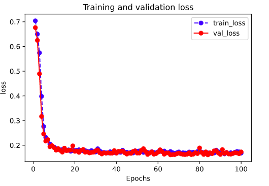
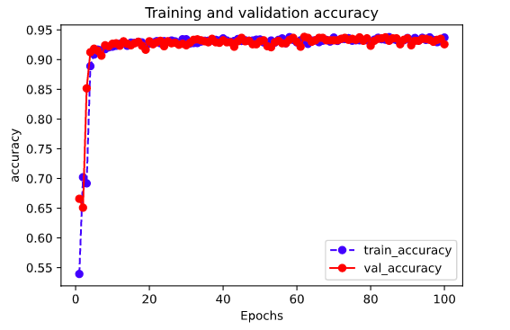

# 3-3,高阶API示范

Pytorch没有官方的高阶API，一般需要用户自己实现训练循环、验证循环、和预测循环。

作者通过仿照tf.keras.Model的功能对Pytorch的nn.Module进行了封装，

实现了 fit, validate，predict, summary 方法，相当于用户自定义高阶API。

并在其基础上实现线性回归模型和DNN二分类模型。


```python
import os
import datetime
from torchkeras import Model, summary

#打印时间
def printbar():
    nowtime = datetime.datetime.now().strftime('%Y-%m-%d %H:%M:%S')
    print("\n"+"=========="*8 + "%s"%nowtime)

#mac系统上pytorch和matplotlib在jupyter中同时跑需要更改环境变量
os.environ["KMP_DUPLICATE_LIB_OK"]="TRUE" 

```

### 一，线性回归模型


此范例我们通过继承上述用户自定义 Model模型接口，实现线性回归模型。


**1，准备数据**

```python
import numpy as np 
import pandas as pd
from matplotlib import pyplot as plt 
import torch
from torch import nn
import torch.nn.functional as F
from torch.utils.data import Dataset,DataLoader,TensorDataset

#样本数量
n = 400

# 生成测试用数据集
X = 10*torch.rand([n,2])-5.0  #torch.rand是均匀分布 
w0 = torch.tensor([[2.0],[-3.0]])
b0 = torch.tensor([[10.0]])
Y = X@w0 + b0 + torch.normal( 0.0,2.0,size = [n,1])  # @表示矩阵乘法,增加正态扰动

```

```python
# 数据可视化

%matplotlib inline
%config InlineBackend.figure_format = 'svg'

plt.figure(figsize = (12,5))
ax1 = plt.subplot(121)
ax1.scatter(X[:,0],Y[:,0], c = "b",label = "samples")
ax1.legend()
plt.xlabel("x1")
plt.ylabel("y",rotation = 0)

ax2 = plt.subplot(122)
ax2.scatter(X[:,1],Y[:,0], c = "g",label = "samples")
ax2.legend()
plt.xlabel("x2")
plt.ylabel("y",rotation = 0)
plt.show()

```


```python
#构建输入数据管道
ds = TensorDataset(X,Y)
ds_train,ds_valid = torch.utils.data.random_split(ds,[int(400*0.7),400-int(400*0.7)])
dl_train = DataLoader(ds_train,batch_size = 10,shuffle=True,num_workers=2)
dl_valid = DataLoader(ds_valid,batch_size = 10,num_workers=2)

```

```python

```

**2，定义模型**

```python
# 继承用户自定义模型
from torchkeras import Model
class LinearRegression(Model):
    def __init__(self):
        super(LinearRegression, self).__init__()
        self.fc = nn.Linear(2,1)
    
    def forward(self,x):
        return self.fc(x)

model = LinearRegression()

```

```python
model.summary(input_shape = (2,))
```

```
----------------------------------------------------------------
        Layer (type)               Output Shape         Param #
================================================================
            Linear-1                    [-1, 1]               3
================================================================
Total params: 3
Trainable params: 3
Non-trainable params: 0
----------------------------------------------------------------
Input size (MB): 0.000008
Forward/backward pass size (MB): 0.000008
Params size (MB): 0.000011
Estimated Total Size (MB): 0.000027
----------------------------------------------------------------
```

```python

```

**3，训练模型**

```python
### 使用fit方法进行训练

def mean_absolute_error(y_pred,y_true):
    return torch.mean(torch.abs(y_pred-y_true))

def mean_absolute_percent_error(y_pred,y_true):
    absolute_percent_error = (torch.abs(y_pred-y_true)+1e-7)/(torch.abs(y_true)+1e-7)
    return torch.mean(absolute_percent_error)

model.compile(loss_func = nn.MSELoss(),
              optimizer= torch.optim.Adam(model.parameters(),lr = 0.01),
              metrics_dict={"mae":mean_absolute_error,"mape":mean_absolute_percent_error})

dfhistory = model.fit(200,dl_train = dl_train, dl_val = dl_valid,log_step_freq = 20)

```

```
Start Training ...

================================================================================2020-07-05 23:07:25
{'step': 20, 'loss': 226.768, 'mae': 12.198, 'mape': 1.212}

 +-------+---------+-------+-------+----------+---------+----------+
| epoch |   loss  |  mae  |  mape | val_loss | val_mae | val_mape |
+-------+---------+-------+-------+----------+---------+----------+
|   1   | 230.773 | 12.41 | 1.394 | 223.262  |  12.582 |  1.095   |
+-------+---------+-------+-------+----------+---------+----------+

================================================================================2020-07-05 23:07:26
{'step': 20, 'loss': 200.964, 'mae': 11.584, 'mape': 1.382}

 +-------+---------+--------+------+----------+---------+----------+
| epoch |   loss  |  mae   | mape | val_loss | val_mae | val_mape |
+-------+---------+--------+------+----------+---------+----------+
|   2   | 206.238 | 11.759 | 1.26 | 199.669  |  11.895 |  1.012   |
+-------+---------+--------+------+----------+---------+----------+

================================================================================2020-07-05 23:07:26
{'step': 20, 'loss': 188.247, 'mae': 11.387, 'mape': 1.172}

 +-------+---------+--------+-------+----------+---------+----------+
| epoch |   loss  |  mae   |  mape | val_loss | val_mae | val_mape |
+-------+---------+--------+-------+----------+---------+----------+
|   3   | 185.185 | 11.177 | 1.189 | 178.112  |  11.24  |  0.952   |
+-------+---------+--------+-------+----------+---------+----------+
================================================================================2020-07-05 23:07:59
{'step': 20, 'loss': 4.14, 'mae': 1.677, 'mape': 1.845}

 +-------+-------+-------+-------+----------+---------+----------+
| epoch |  loss |  mae  |  mape | val_loss | val_mae | val_mape |
+-------+-------+-------+-------+----------+---------+----------+
|  199  | 4.335 | 1.707 | 1.441 |  3.741   |  1.533  |  0.359   |
+-------+-------+-------+-------+----------+---------+----------+

================================================================================2020-07-05 23:07:59
{'step': 20, 'loss': 4.653, 'mae': 1.775, 'mape': 0.679}

 +-------+------+-------+-------+----------+---------+----------+
| epoch | loss |  mae  |  mape | val_loss | val_mae | val_mape |
+-------+------+-------+-------+----------+---------+----------+
|  200  | 4.37 | 1.718 | 1.394 |  3.749   |  1.534  |  0.363   |
+-------+------+-------+-------+----------+---------+----------+

================================================================================2020-07-05 23:07:59
Finished Training...
```

```python
# 结果可视化

%matplotlib inline
%config InlineBackend.figure_format = 'svg'

w,b = model.state_dict()["fc.weight"],model.state_dict()["fc.bias"]

plt.figure(figsize = (12,5))
ax1 = plt.subplot(121)
ax1.scatter(X[:,0],Y[:,0], c = "b",label = "samples")
ax1.plot(X[:,0],w[0,0]*X[:,0]+b[0],"-r",linewidth = 5.0,label = "model")
ax1.legend()
plt.xlabel("x1")
plt.ylabel("y",rotation = 0)


ax2 = plt.subplot(122)
ax2.scatter(X[:,1],Y[:,0], c = "g",label = "samples")
ax2.plot(X[:,1],w[0,1]*X[:,1]+b[0],"-r",linewidth = 5.0,label = "model")
ax2.legend()
plt.xlabel("x2")
plt.ylabel("y",rotation = 0)

plt.show()

```

**4，评估模型**

```python
dfhistory.tail()
```


```python
%matplotlib inline
%config InlineBackend.figure_format = 'svg'

import matplotlib.pyplot as plt

def plot_metric(dfhistory, metric):
    train_metrics = dfhistory[metric]
    val_metrics = dfhistory['val_'+metric]
    epochs = range(1, len(train_metrics) + 1)
    plt.plot(epochs, train_metrics, 'bo--')
    plt.plot(epochs, val_metrics, 'ro-')
    plt.title('Training and validation '+ metric)
    plt.xlabel("Epochs")
    plt.ylabel(metric)
    plt.legend(["train_"+metric, 'val_'+metric])
    plt.show()
    
```

```python
plot_metric(dfhistory,"loss")
```


```python
plot_metric(dfhistory,"mape")
```


```python
# 评估
model.evaluate(dl_valid)
```

```
{'val_loss': 3.749117374420166,
 'val_mae': 1.5336137612660725,
 'val_mape': 0.36319838215907413}
```

```python

```

**5，使用模型**

```python
# 预测
dl = DataLoader(TensorDataset(X))
model.predict(dl)[0:10]
```

```
tensor([[ 3.9212],
        [ 8.6336],
        [ 6.1982],
        [ 6.1212],
        [-5.0974],
        [-6.3183],
        [ 4.6588],
        [ 5.5349],
        [11.9106],
        [24.6937]])
```

```python
# 预测
model.predict(dl_valid)[0:10]
```

```
tensor([[ 2.8368],
        [16.2797],
        [ 2.3135],
        [ 9.5395],
        [16.4363],
        [10.0742],
        [15.0864],
        [12.9775],
        [21.8568],
        [21.8226]])
```

```python

```

### 二，DNN二分类模型


此范例我们通过继承上述用户自定义 Model模型接口，实现DNN二分类模型。


**1，准备数据**

```python
import numpy as np 
import pandas as pd 
from matplotlib import pyplot as plt
import torch
from torch import nn
import torch.nn.functional as F
from torch.utils.data import Dataset,DataLoader,TensorDataset
import torchkeras 
%matplotlib inline
%config InlineBackend.figure_format = 'svg'

#正负样本数量
n_positive,n_negative = 2000,2000

#生成正样本, 小圆环分布
r_p = 5.0 + torch.normal(0.0,1.0,size = [n_positive,1]) 
theta_p = 2*np.pi*torch.rand([n_positive,1])
Xp = torch.cat([r_p*torch.cos(theta_p),r_p*torch.sin(theta_p)],axis = 1)
Yp = torch.ones_like(r_p)

#生成负样本, 大圆环分布
r_n = 8.0 + torch.normal(0.0,1.0,size = [n_negative,1]) 
theta_n = 2*np.pi*torch.rand([n_negative,1])
Xn = torch.cat([r_n*torch.cos(theta_n),r_n*torch.sin(theta_n)],axis = 1)
Yn = torch.zeros_like(r_n)

#汇总样本
X = torch.cat([Xp,Xn],axis = 0)
Y = torch.cat([Yp,Yn],axis = 0)


#可视化
plt.figure(figsize = (6,6))
plt.scatter(Xp[:,0],Xp[:,1],c = "r")
plt.scatter(Xn[:,0],Xn[:,1],c = "g")
plt.legend(["positive","negative"]);

```


```python
ds = TensorDataset(X,Y)

ds_train,ds_valid = torch.utils.data.random_split(ds,[int(len(ds)*0.7),len(ds)-int(len(ds)*0.7)])
dl_train = DataLoader(ds_train,batch_size = 100,shuffle=True,num_workers=2)
dl_valid = DataLoader(ds_valid,batch_size = 100,num_workers=2)

```

```python

```

**2，定义模型**

```python

class Net(nn.Module):
    def __init__(self):
        super().__init__()
        self.fc1 = nn.Linear(2,4)
        self.fc2 = nn.Linear(4,8) 
        self.fc3 = nn.Linear(8,1)
        
    def forward(self,x):
        x = F.relu(self.fc1(x))
        x = F.relu(self.fc2(x))
        y = nn.Sigmoid()(self.fc3(x))
        return y
        
model = torchkeras.Model(Net())
model.summary(input_shape =(2,))
```

```
----------------------------------------------------------------
        Layer (type)               Output Shape         Param #
================================================================
            Linear-1                    [-1, 4]              12
            Linear-2                    [-1, 8]              40
            Linear-3                    [-1, 1]               9
================================================================
Total params: 61
Trainable params: 61
Non-trainable params: 0
----------------------------------------------------------------
Input size (MB): 0.000008
Forward/backward pass size (MB): 0.000099
Params size (MB): 0.000233
Estimated Total Size (MB): 0.000340
----------------------------------------------------------------
```


**3，训练模型**

```python
# 准确率
def accuracy(y_pred,y_true):
    y_pred = torch.where(y_pred>0.5,torch.ones_like(y_pred,dtype = torch.float32),
                      torch.zeros_like(y_pred,dtype = torch.float32))
    acc = torch.mean(1-torch.abs(y_true-y_pred))
    return acc

model.compile(loss_func = nn.BCELoss(),optimizer= torch.optim.Adam(model.parameters(),lr = 0.01),
             metrics_dict={"accuracy":accuracy})

dfhistory = model.fit(100,dl_train = dl_train,dl_val = dl_valid,log_step_freq = 10)

```

```
Start Training ...

================================================================================2020-07-05 23:12:51
{'step': 10, 'loss': 0.733, 'accuracy': 0.487}
{'step': 20, 'loss': 0.713, 'accuracy': 0.515}

 +-------+-------+----------+----------+--------------+
| epoch |  loss | accuracy | val_loss | val_accuracy |
+-------+-------+----------+----------+--------------+
|   1   | 0.704 |  0.539   |  0.676   |    0.666     |
+-------+-------+----------+----------+--------------+

================================================================================2020-07-05 23:12:51
{'step': 10, 'loss': 0.67, 'accuracy': 0.703}
{'step': 20, 'loss': 0.66, 'accuracy': 0.697}

 +-------+------+----------+----------+--------------+
| epoch | loss | accuracy | val_loss | val_accuracy |
+-------+------+----------+----------+--------------+
|   2   | 0.65 |  0.702   |  0.625   |    0.651     |
+-------+------+----------+----------+--------------+
================================================================================2020-07-05 23:13:10
{'step': 10, 'loss': 0.17, 'accuracy': 0.929}
{'step': 20, 'loss': 0.173, 'accuracy': 0.929}

 +-------+-------+----------+----------+--------------+
| epoch |  loss | accuracy | val_loss | val_accuracy |
+-------+-------+----------+----------+--------------+
|   98  | 0.175 |  0.929   |  0.169   |    0.933     |
+-------+-------+----------+----------+--------------+

================================================================================2020-07-05 23:13:10
{'step': 10, 'loss': 0.165, 'accuracy': 0.942}
{'step': 20, 'loss': 0.171, 'accuracy': 0.932}

 +-------+-------+----------+----------+--------------+
| epoch |  loss | accuracy | val_loss | val_accuracy |
+-------+-------+----------+----------+--------------+
|   99  | 0.173 |  0.931   |  0.166   |    0.935     |
+-------+-------+----------+----------+--------------+

================================================================================2020-07-05 23:13:10
{'step': 10, 'loss': 0.156, 'accuracy': 0.945}
{'step': 20, 'loss': 0.17, 'accuracy': 0.935}

 +-------+-------+----------+----------+--------------+
| epoch |  loss | accuracy | val_loss | val_accuracy |
+-------+-------+----------+----------+--------------+
|  100  | 0.168 |  0.937   |  0.173   |    0.926     |
+-------+-------+----------+----------+--------------+

================================================================================2020-07-05 23:13:11
Finished Training...
```

```python
# 结果可视化
fig, (ax1,ax2) = plt.subplots(nrows=1,ncols=2,figsize = (12,5))
ax1.scatter(Xp[:,0],Xp[:,1], c="r")
ax1.scatter(Xn[:,0],Xn[:,1],c = "g")
ax1.legend(["positive","negative"]);
ax1.set_title("y_true");

Xp_pred = X[torch.squeeze(model.forward(X)>=0.5)]
Xn_pred = X[torch.squeeze(model.forward(X)<0.5)]

ax2.scatter(Xp_pred[:,0],Xp_pred[:,1],c = "r")
ax2.scatter(Xn_pred[:,0],Xn_pred[:,1],c = "g")
ax2.legend(["positive","negative"]);
ax2.set_title("y_pred");

```


**4，评估模型**

```python
%matplotlib inline
%config InlineBackend.figure_format = 'svg'

import matplotlib.pyplot as plt

def plot_metric(dfhistory, metric):
    train_metrics = dfhistory[metric]
    val_metrics = dfhistory['val_'+metric]
    epochs = range(1, len(train_metrics) + 1)
    plt.plot(epochs, train_metrics, 'bo--')
    plt.plot(epochs, val_metrics, 'ro-')
    plt.title('Training and validation '+ metric)
    plt.xlabel("Epochs")
    plt.ylabel(metric)
    plt.legend(["train_"+metric, 'val_'+metric])
    plt.show()
```

```python
plot_metric(dfhistory,"loss")
```



```python
plot_metric(dfhistory,"accuracy")
```



```python
model.evaluate(dl_valid)
```

```
{'val_loss': 0.17309962399303913, 'val_accuracy': 0.9258333394924799}
```


**5，使用模型**

```python
model.predict(dl_valid)[0:10]
```

```
tensor([[0.9998],
        [0.0459],
        [0.0349],
        [0.0147],
        [0.9990],
        [0.9995],
        [0.8535],
        [0.0373],
        [0.2134],
        [0.9356]])

```

```python

```

如果对本书内容理解上有需要进一步和作者交流的地方，欢迎在公众号"Python与算法之美"下留言。作者时间和精力有限，会酌情予以回复。

也可以在公众号后台回复关键字：**加群**，加入读者交流群和大家讨论。


