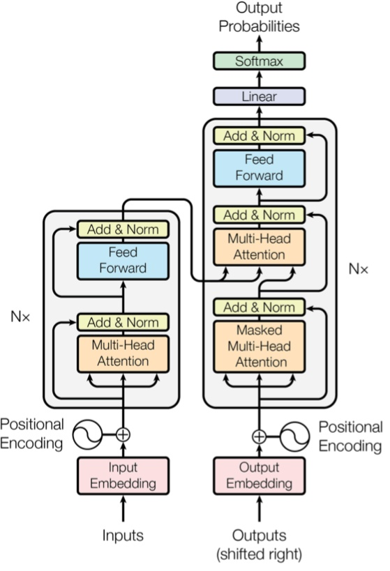

# 5-2,模型层layers

深度学习模型一般由各种模型层组合而成。

torch.nn中内置了非常丰富的各种模型层。它们都属于nn.Module的子类，具备参数管理功能。

例如：

* nn.Linear, nn.Flatten, nn.Dropout, nn.BatchNorm2d

* nn.Conv2d,nn.AvgPool2d,nn.Conv1d,nn.ConvTranspose2d

* nn.Embedding,nn.GRU,nn.LSTM

* nn.Transformer

如果这些内置模型层不能够满足需求，我们也可以通过继承nn.Module基类构建自定义的模型层。

实际上，pytorch不区分模型和模型层，都是通过继承nn.Module进行构建。

因此，我们只要继承nn.Module基类并实现forward方法即可自定义模型层。


```python

```

### 一，内置模型层

```python
import numpy as np 
import torch 
from torch import nn 
```

<!-- #region -->
一些常用的内置模型层简单介绍如下。


**基础层**

* nn.Linear：全连接层。参数个数 = 输入层特征数× 输出层特征数(weight)＋ 输出层特征数(bias)

* nn.Flatten：压平层，用于将多维张量样本压成一维张量样本。

* nn.BatchNorm1d：一维批标准化层。通过线性变换将输入批次缩放平移到稳定的均值和标准差。可以增强模型对输入不同分布的适应性，加快模型训练速度，有轻微正则化效果。一般在激活函数之前使用。可以用afine参数设置该层是否含有可以训练的参数。

* nn.BatchNorm2d：二维批标准化层。

* nn.BatchNorm3d：三维批标准化层。

* nn.Dropout：一维随机丢弃层。一种正则化手段。

* nn.Dropout2d：二维随机丢弃层。

* nn.Dropout3d：三维随机丢弃层。

* nn.Threshold：限幅层。当输入大于或小于阈值范围时，截断之。

* nn.ConstantPad2d： 二维常数填充层。对二维张量样本填充常数扩展长度。

* nn.ReplicationPad1d： 一维复制填充层。对一维张量样本通过复制边缘值填充扩展长度。

* nn.ZeroPad2d：二维零值填充层。对二维张量样本在边缘填充0值.

* nn.GroupNorm：组归一化。一种替代批归一化的方法，将通道分成若干组进行归一。不受batch大小限制，据称性能和效果都优于BatchNorm。

* nn.LayerNorm：层归一化。较少使用。

* nn.InstanceNorm2d: 样本归一化。较少使用。


各种归一化技术参考如下知乎文章《FAIR何恺明等人提出组归一化：替代批归一化，不受批量大小限制》

https://zhuanlan.zhihu.com/p/34858971


<!-- #endregion -->

**卷积网络相关层**

* nn.Conv1d：普通一维卷积，常用于文本。参数个数 = 输入通道数×卷积核尺寸(如3)×卷积核个数 + 卷积核尺寸(如3）
  
* nn.Conv2d：普通二维卷积，常用于图像。参数个数 = 输入通道数×卷积核尺寸(如3乘3)×卷积核个数 + 卷积核尺寸(如3乘3)
  通过调整dilation参数大于1，可以变成空洞卷积，增大卷积核感受野。
  通过调整groups参数不为1，可以变成分组卷积。分组卷积中不同分组使用相同的卷积核，显著减少参数数量。
  当groups参数等于通道数时，相当于tensorflow中的二维深度卷积层tf.keras.layers.DepthwiseConv2D。
  利用分组卷积和1乘1卷积的组合操作，可以构造相当于Keras中的二维深度可分离卷积层tf.keras.layers.SeparableConv2D。

* nn.Conv3d：普通三维卷积，常用于视频。参数个数 = 输入通道数×卷积核尺寸(如3乘3乘3)×卷积核个数 + 卷积核尺寸(如3乘3乘3) 。

* nn.MaxPool1d: 一维最大池化。

* nn.MaxPool2d：二维最大池化。一种下采样方式。没有需要训练的参数。

* nn.MaxPool3d：三维最大池化。

* nn.AdaptiveMaxPool2d：二维自适应最大池化。无论输入图像的尺寸如何变化，输出的图像尺寸是固定的。
  该函数的实现原理，大概是通过输入图像的尺寸和要得到的输出图像的尺寸来反向推算池化算子的padding,stride等参数。
  
* nn.FractionalMaxPool2d：二维分数最大池化。普通最大池化通常输入尺寸是输出的整数倍。而分数最大池化则可以不必是整数。分数最大池化使用了一些随机采样策略，有一定的正则效果，可以用它来代替普通最大池化和Dropout层。

* nn.AvgPool2d：二维平均池化。

* nn.AdaptiveAvgPool2d：二维自适应平均池化。无论输入的维度如何变化，输出的维度是固定的。

* nn.ConvTranspose2d：二维卷积转置层，俗称反卷积层。并非卷积的逆操作，但在卷积核相同的情况下，当其输入尺寸是卷积操作输出尺寸的情况下，卷积转置的输出尺寸恰好是卷积操作的输入尺寸。在语义分割中可用于上采样。

* nn.Upsample：上采样层，操作效果和池化相反。可以通过mode参数控制上采样策略为"nearest"最邻近策略或"linear"线性插值策略。

* nn.Unfold：滑动窗口提取层。其参数和卷积操作nn.Conv2d相同。实际上，卷积操作可以等价于nn.Unfold和nn.Linear以及nn.Fold的一个组合。
  其中nn.Unfold操作可以从输入中提取各个滑动窗口的数值矩阵，并将其压平成一维。利用nn.Linear将nn.Unfold的输出和卷积核做乘法后，再使用
  nn.Fold操作将结果转换成输出图片形状。

* nn.Fold：逆滑动窗口提取层。


**循环网络相关层**

* nn.Embedding：嵌入层。一种比Onehot更加有效的对离散特征进行编码的方法。一般用于将输入中的单词映射为稠密向量。嵌入层的参数需要学习。

* nn.LSTM：长短记忆循环网络层【支持多层】。最普遍使用的循环网络层。具有携带轨道，遗忘门，更新门，输出门。可以较为有效地缓解梯度消失问题，从而能够适用长期依赖问题。设置bidirectional = True时可以得到双向LSTM。需要注意的时，默认的输入和输出形状是(seq,batch,feature), 如果需要将batch维度放在第0维，则要设置batch_first参数设置为True。

* nn.GRU：门控循环网络层【支持多层】。LSTM的低配版，不具有携带轨道，参数数量少于LSTM，训练速度更快。

* nn.RNN：简单循环网络层【支持多层】。容易存在梯度消失，不能够适用长期依赖问题。一般较少使用。

* nn.LSTMCell：长短记忆循环网络单元。和nn.LSTM在整个序列上迭代相比，它仅在序列上迭代一步。一般较少使用。

* nn.GRUCell：门控循环网络单元。和nn.GRU在整个序列上迭代相比，它仅在序列上迭代一步。一般较少使用。

* nn.RNNCell：简单循环网络单元。和nn.RNN在整个序列上迭代相比，它仅在序列上迭代一步。一般较少使用。


**Transformer相关层**

* nn.Transformer：Transformer网络结构。Transformer网络结构是替代循环网络的一种结构，解决了循环网络难以并行，难以捕捉长期依赖的缺陷。它是目前NLP任务的主流模型的主要构成部分。Transformer网络结构由TransformerEncoder编码器和TransformerDecoder解码器组成。编码器和解码器的核心是MultiheadAttention多头注意力层。

* nn.TransformerEncoder：Transformer编码器结构。由多个 nn.TransformerEncoderLayer编码器层组成。

* nn.TransformerDecoder：Transformer解码器结构。由多个 nn.TransformerDecoderLayer解码器层组成。

* nn.TransformerEncoderLayer：Transformer的编码器层。

* nn.TransformerDecoderLayer：Transformer的解码器层。

* nn.MultiheadAttention：多头注意力层。

Transformer原理介绍可以参考如下知乎文章《详解Transformer(Attention Is All You Need)》

https://zhuanlan.zhihu.com/p/48508221



```python

```

### 二，自定义模型层


如果Pytorch的内置模型层不能够满足需求，我们也可以通过继承nn.Module基类构建自定义的模型层。

实际上，pytorch不区分模型和模型层，都是通过继承nn.Module进行构建。

因此，我们只要继承nn.Module基类并实现forward方法即可自定义模型层。

下面是Pytorch的nn.Linear层的源码，我们可以仿照它来自定义模型层。


```python
import torch
from torch import nn
import torch.nn.functional as F


class Linear(nn.Module):
    __constants__ = ['in_features', 'out_features']

    def __init__(self, in_features, out_features, bias=True):
        super(Linear, self).__init__()
        self.in_features = in_features
        self.out_features = out_features
        self.weight = nn.Parameter(torch.Tensor(out_features, in_features))
        if bias:
            self.bias = nn.Parameter(torch.Tensor(out_features))
        else:
            self.register_parameter('bias', None)
        self.reset_parameters()

    def reset_parameters(self):
        nn.init.kaiming_uniform_(self.weight, a=math.sqrt(5))
        if self.bias is not None:
            fan_in, _ = nn.init._calculate_fan_in_and_fan_out(self.weight)
            bound = 1 / math.sqrt(fan_in)
            nn.init.uniform_(self.bias, -bound, bound)

    def forward(self, input):
        return F.linear(input, self.weight, self.bias)

    def extra_repr(self):
        return 'in_features={}, out_features={}, bias={}'.format(
            self.in_features, self.out_features, self.bias is not None
        )
```

```python
linear = nn.Linear(20, 30)
inputs = torch.randn(128, 20)
output = linear(inputs)
print(output.size())
```

```
torch.Size([128, 30])
```

```python

```

**如果本书对你有所帮助，想鼓励一下作者，记得给本项目加一颗星星star⭐️，并分享给你的朋友们喔😊!** 

如果对本书内容理解上有需要进一步和作者交流的地方，欢迎在公众号"算法美食屋"下留言。作者时间和精力有限，会酌情予以回复。

也可以在公众号后台回复关键字：**加群**，加入读者交流群和大家讨论。


