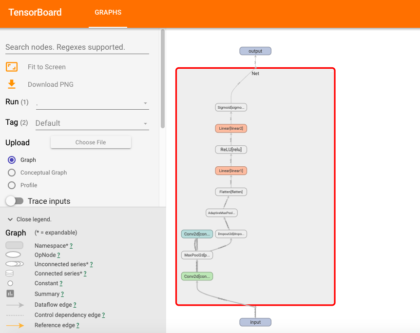
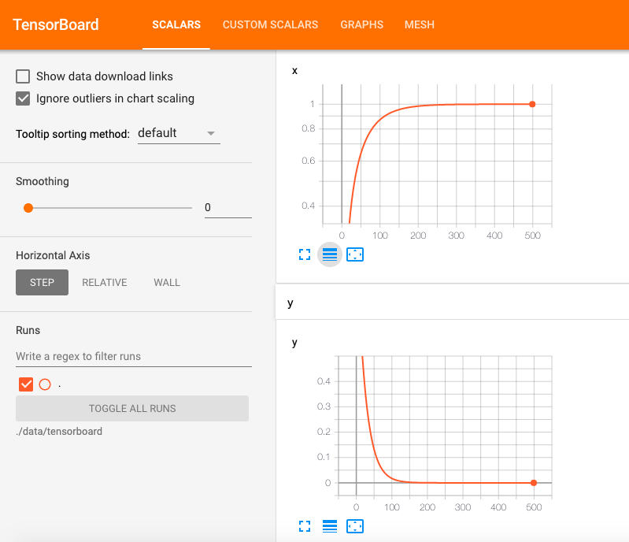

# 5-4,TensorBoard可视化

在我们的炼丹过程中，如果能够使用丰富的图像来展示模型的结构，指标的变化，参数的分布，输入的形态等信息，无疑会提升我们对问题的洞察力，并增加许多炼丹的乐趣。

TensorBoard正是这样一个神奇的炼丹可视化辅助工具。它原是TensorFlow的小弟，但它也能够很好地和Pytorch进行配合。甚至在Pytorch中使用TensorBoard比TensorFlow中使用TensorBoard还要来的更加简单和自然。

Pytorch中利用TensorBoard可视化的大概过程如下：

首先在Pytorch中指定一个目录创建一个torch.utils.tensorboard.SummaryWriter日志写入器。

然后根据需要可视化的信息，利用日志写入器将相应信息日志写入我们指定的目录。

最后就可以传入日志目录作为参数启动TensorBoard，然后就可以在TensorBoard中愉快地看片了。

我们主要介绍Pytorch中利用TensorBoard进行如下方面信息的可视化的方法。

* 可视化模型结构： writer.add_graph

* 可视化指标变化： writer.add_scalar

* 可视化参数分布： writer.add_histogram

* 可视化原始图像： writer.add_image 或 writer.add_images

* 可视化人工绘图： writer.add_figure


```python

```

### 一，可视化模型结构

```python
import torch 
from torch import nn
from torch.utils.tensorboard import SummaryWriter
from torchkeras import Model,summary
```

```python
class Net(nn.Module):
    
    def __init__(self):
        super(Net, self).__init__()
        self.conv1 = nn.Conv2d(in_channels=3,out_channels=32,kernel_size = 3)
        self.pool = nn.MaxPool2d(kernel_size = 2,stride = 2)
        self.conv2 = nn.Conv2d(in_channels=32,out_channels=64,kernel_size = 5)
        self.dropout = nn.Dropout2d(p = 0.1)
        self.adaptive_pool = nn.AdaptiveMaxPool2d((1,1))
        self.flatten = nn.Flatten()
        self.linear1 = nn.Linear(64,32)
        self.relu = nn.ReLU()
        self.linear2 = nn.Linear(32,1)
        self.sigmoid = nn.Sigmoid()
        
    def forward(self,x):
        x = self.conv1(x)
        x = self.pool(x)
        x = self.conv2(x)
        x = self.pool(x)
        x = self.dropout(x)
        x = self.adaptive_pool(x)
        x = self.flatten(x)
        x = self.linear1(x)
        x = self.relu(x)
        x = self.linear2(x)
        y = self.sigmoid(x)
        return y
        
net = Net()
print(net)
```

```
Net(
  (conv1): Conv2d(3, 32, kernel_size=(3, 3), stride=(1, 1))
  (pool): MaxPool2d(kernel_size=2, stride=2, padding=0, dilation=1, ceil_mode=False)
  (conv2): Conv2d(32, 64, kernel_size=(5, 5), stride=(1, 1))
  (dropout): Dropout2d(p=0.1, inplace=False)
  (adaptive_pool): AdaptiveMaxPool2d(output_size=(1, 1))
  (flatten): Flatten()
  (linear1): Linear(in_features=64, out_features=32, bias=True)
  (relu): ReLU()
  (linear2): Linear(in_features=32, out_features=1, bias=True)
  (sigmoid): Sigmoid()
)
```

```python
summary(net,input_shape= (3,32,32))
```

```
----------------------------------------------------------------
        Layer (type)               Output Shape         Param #
================================================================
            Conv2d-1           [-1, 32, 30, 30]             896
         MaxPool2d-2           [-1, 32, 15, 15]               0
            Conv2d-3           [-1, 64, 11, 11]          51,264
         MaxPool2d-4             [-1, 64, 5, 5]               0
         Dropout2d-5             [-1, 64, 5, 5]               0
 AdaptiveMaxPool2d-6             [-1, 64, 1, 1]               0
           Flatten-7                   [-1, 64]               0
            Linear-8                   [-1, 32]           2,080
              ReLU-9                   [-1, 32]               0
           Linear-10                    [-1, 1]              33
          Sigmoid-11                    [-1, 1]               0
================================================================
Total params: 54,273
Trainable params: 54,273
Non-trainable params: 0
----------------------------------------------------------------
Input size (MB): 0.011719
Forward/backward pass size (MB): 0.359634
Params size (MB): 0.207035
Estimated Total Size (MB): 0.578388
----------------------------------------------------------------
```

```python
writer = SummaryWriter('./data/tensorboard')
writer.add_graph(net,input_to_model = torch.rand(1,3,32,32))
writer.close()
```

```python
%load_ext tensorboard
#%tensorboard --logdir ./data/tensorboard
```

```python
from tensorboard import notebook
#查看启动的tensorboard程序
notebook.list() 
```

```python
#启动tensorboard程序
notebook.start("--logdir ./data/tensorboard")
#等价于在命令行中执行 tensorboard --logdir ./data/tensorboard
#可以在浏览器中打开 http://localhost:6006/ 查看
```



```python

```

### 二，可视化指标变化


有时候在训练过程中，如果能够实时动态地查看loss和各种metric的变化曲线，那么无疑可以帮助我们更加直观地了解模型的训练情况。

注意，writer.add_scalar仅能对标量的值的变化进行可视化。因此它一般用于对loss和metric的变化进行可视化分析。


```python
import numpy as np 
import torch 
from torch.utils.tensorboard import SummaryWriter


# f(x) = a*x**2 + b*x + c的最小值
x = torch.tensor(0.0,requires_grad = True) # x需要被求导
a = torch.tensor(1.0)
b = torch.tensor(-2.0)
c = torch.tensor(1.0)

optimizer = torch.optim.SGD(params=[x],lr = 0.01)


def f(x):
    result = a*torch.pow(x,2) + b*x + c 
    return(result)

writer = SummaryWriter('./data/tensorboard')
for i in range(500):
    optimizer.zero_grad()
    y = f(x)
    y.backward()
    optimizer.step()
    writer.add_scalar("x",x.item(),i) #日志中记录x在第step i 的值
    writer.add_scalar("y",y.item(),i) #日志中记录y在第step i 的值

writer.close()
    
print("y=",f(x).data,";","x=",x.data)
```

```
y= tensor(0.) ; x= tensor(1.0000)
```




```python

```

### 三，可视化参数分布


如果需要对模型的参数(一般非标量)在训练过程中的变化进行可视化，可以使用 writer.add_histogram。

它能够观测张量值分布的直方图随训练步骤的变化趋势。

```python
import numpy as np 
import torch 
from torch.utils.tensorboard import SummaryWriter


# 创建正态分布的张量模拟参数矩阵
def norm(mean,std):
    t = std*torch.randn((100,20))+mean
    return t

writer = SummaryWriter('./data/tensorboard')
for step,mean in enumerate(range(-10,10,1)):
    w = norm(mean,1)
    writer.add_histogram("w",w, step)
    writer.flush()
writer.close()
    

```


```python

```

### 四，可视化原始图像


如果我们做图像相关的任务，也可以将原始的图片在tensorboard中进行可视化展示。

如果只写入一张图片信息，可以使用writer.add_image。

如果要写入多张图片信息，可以使用writer.add_images。

也可以用 torchvision.utils.make_grid将多张图片拼成一张图片，然后用writer.add_image写入。

注意，传入的是代表图片信息的Pytorch中的张量数据。


```python
import torch
import torchvision
from torch import nn
from torch.utils.data import Dataset,DataLoader
from torchvision import transforms,datasets 


transform_train = transforms.Compose(
    [transforms.ToTensor()])
transform_valid = transforms.Compose(
    [transforms.ToTensor()])

```

```python
ds_train = datasets.ImageFolder("./data/cifar2/train/",
            transform = transform_train,target_transform= lambda t:torch.tensor([t]).float())
ds_valid = datasets.ImageFolder("./data/cifar2/test/",
            transform = transform_train,target_transform= lambda t:torch.tensor([t]).float())

print(ds_train.class_to_idx)

dl_train = DataLoader(ds_train,batch_size = 50,shuffle = True,num_workers=3)
dl_valid = DataLoader(ds_valid,batch_size = 50,shuffle = True,num_workers=3)

dl_train_iter = iter(dl_train)
images, labels = dl_train_iter.next()

# 仅查看一张图片
writer = SummaryWriter('./data/tensorboard')
writer.add_image('images[0]', images[0])
writer.close()

# 将多张图片拼接成一张图片，中间用黑色网格分割
writer = SummaryWriter('./data/tensorboard')
# create grid of images
img_grid = torchvision.utils.make_grid(images)
writer.add_image('image_grid', img_grid)
writer.close()

# 将多张图片直接写入
writer = SummaryWriter('./data/tensorboard')
writer.add_images("images",images,global_step = 0)
writer.close()
```

```
{'0_airplane': 0, '1_automobile': 1}
```

```python

```


```python

```

### 五，可视化人工绘图


如果我们将matplotlib绘图的结果再 tensorboard中展示，可以使用 add_figure.

注意，和writer.add_image不同的是，writer.add_figure需要传入matplotlib的figure对象。


```python
import torch
import torchvision
from torch import nn
from torch.utils.data import Dataset,DataLoader
from torchvision import transforms,datasets 


transform_train = transforms.Compose(
    [transforms.ToTensor()])
transform_valid = transforms.Compose(
    [transforms.ToTensor()])

ds_train = datasets.ImageFolder("./data/cifar2/train/",
            transform = transform_train,target_transform= lambda t:torch.tensor([t]).float())
ds_valid = datasets.ImageFolder("./data/cifar2/test/",
            transform = transform_train,target_transform= lambda t:torch.tensor([t]).float())

print(ds_train.class_to_idx)
```

```
{'0_airplane': 0, '1_automobile': 1}
```

```python
%matplotlib inline
%config InlineBackend.figure_format = 'svg'
from matplotlib import pyplot as plt 

figure = plt.figure(figsize=(8,8)) 
for i in range(9):
    img,label = ds_train[i]
    img = img.permute(1,2,0)
    ax=plt.subplot(3,3,i+1)
    ax.imshow(img.numpy())
    ax.set_title("label = %d"%label.item())
    ax.set_xticks([])
    ax.set_yticks([]) 
plt.show()
```


```python
writer = SummaryWriter('./data/tensorboard')
writer.add_figure('figure',figure,global_step=0)
writer.close()                         
```


**如果本书对你有所帮助，想鼓励一下作者，记得给本项目加一颗星星star⭐️，并分享给你的朋友们喔😊!** 

如果对本书内容理解上有需要进一步和作者交流的地方，欢迎在公众号"算法美食屋"下留言。作者时间和精力有限，会酌情予以回复。

也可以在公众号后台回复关键字：**加群**，加入读者交流群和大家讨论。


```python

```

```python

```
